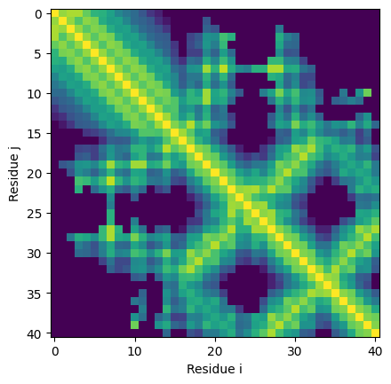
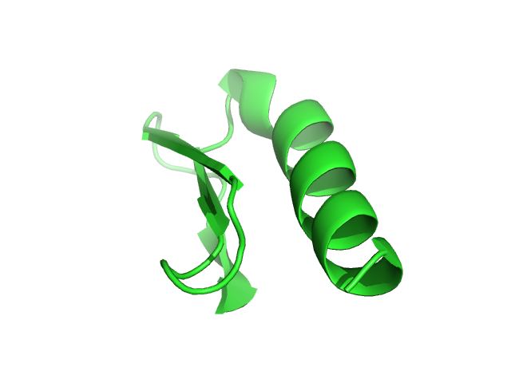

# AlphaFoldv1 Pipeline

The purpose of this repository is purely for (my) **learning purposes** and it's the hope that it may be useful to others.  

The code here was copied directly over from [AlphaFoldv1 github repository](https://github.com/deepmind/deepmind-research/tree/master/alphafold_casp13).
Copied over as I didn't want to fork the entire deepmind-research reposity. At the moment many have realized that the AlphaFoldv1 code publicly shared is 
very limited and does not include code for creating the input .trec files or more importantly the **folding to produce the folded structure** (i.e. PDB file).
The code only produces the distance probabilities (i.e. distograms) and torsion probabilities, which form the constraints used for folding. This repository
aims to implement the missing preparation of the .trec files and the **folding.**  

## Disclamer
My expertise is in Human Genetics and Computional Biology. I have no claims that the implementation is correct and it's more for educational purposes.

## Thanks
The description in the AlphaFoldv1 Nature [paper](https://www.nature.com/articles/s41586-019-1923-7) and [supplementary](https://static-content.springer.com/esm/art%3A10.1038%2Fs41586-019-1923-7/MediaObjects/41586_2019_1923_MOESM1_ESM.pdf) unfortunately does not have enough information for a scrub like me to implement beyond just running it and producing the same distogram and torsion probabilities. All credit and thanks should go to [**Jinbo Xu**](https://www.ttic.edu/faculty/xu/) for making the various implementation of RaptorX fully open source and available so that others can learn the various aspects of distance-based folding approaches. Jinbo is a pioneer in using distance-based folding approaches that AlphaFoldv1 uses and was the first to show it's value in his [PLoS Computational Biology publication.](https://journals.plos.org/ploscompbiol/article?id=10.1371/journal.pcbi.1005324)

## Setting up
The dependencies below were taken the AlphaFoldv1 dependencies section. There are a few notable differences:
* gast version 0.2.2 is enforced to remove incompatibility [issues](https://github.com/tensorflow/tensorflow/issues/32859) with later versions.
* SciPy is needed for the Von Mises distribution
* PyRosetta is needed for the folding. You will need a license to install. Thankfully academic license is free and receiving one is fully automated.

### Dependencies

*   Python 3.6+.
*   [Abseil 0.8.0](https://github.com/abseil/abseil-py)
*   [Numpy 1.16](https://numpy.org)
*   [Six 1.12](https://pypi.org/project/six/)
*   [Setuptools 41.0.0](https://setuptools.readthedocs.io/en/latest/)
*   [Sonnet 1.35](https://github.com/deepmind/sonnet)
*   [TensorFlow 1.14](https://tensorflow.org). Not compatible with TensorFlow
    2.0+.
*   [TensorFlow Probability 0.7.0](https://www.tensorflow.org/probability)
*	[SciPy](https://www.scipy.org/install.html)
* 	[PyRosetta](http://www.pyrosetta.org/dow)

```
python3 -m venv alphafold_venv
source alphafold_venv/bin/activate
pip install -r alphafold_casp13/requirements.txt
```

## Step 1: Creation of features for input as .trec file
DeepMind has provided example input files in trec format for each of their CASP13 submissions. However, most people are interested in trying the prediction on
their own sequence of interest so will need to generate their own input files. This was described in the [AlphaFoldv1 github repository](https://github.com/deepmind/deepmind-research/tree/master/alphafold_casp13) but there isn't a full implementation. Briefly, this requires doing a multiple sequence alignment (MSA) of your
protein sequence of interest against a protein database. Using this MSA, features are then extracted and formatted as described into a trec file as input. This 
[github repository](https://github.com/Urinx/alphafold_pytorch) uses the AlphaFoldv1 models using a PyTorch framework but has a full implementation on how this trec input files can be generated. 

TO DO - I would like to create my own implementation using this code base to build upon that works better with the AlphaFoldv1 existing code even though some of the libraries used may be outdated.  

These are two other great examples on how MSA can be created and features extracted  
https://github.com/dellacortelab/prospr  
https://github.com/j3xugit/RaptorX-3DModeling  


However both these implementation are again aimed at only producing the distance probabilities (i.e. distograms) and torsion probabilities.

## Step 2: Creation of distance and torsion probabilities
See the AlphaFoldv1 [Instructions](https://github.com/deepmind/deepmind-research/blob/master/alphafold_casp13/README.md) 
particular the [run_eval.sh script](https://github.com/deepmind/deepmind-research/blob/master/alphafold_casp13/run_eval.sh)  

Note: This is limited to only the .trec files created for CASP13. To run this on a protein sequence of interest you will need to prepare your own input files detailed
in step 1.

### Plotting distogram
```
python3 plot_distogram.py -d test_output/T0955/distogram/ensemble/T0955.pickle -o test.png
```

This is the equivalent of Figure 3B in the [Nature Publication](https://www.nature.com/articles/s41586-019-1923-7). It's slightly different so not sure why.. but close enough!

## Step 3: Folding and creating PDB files
I decided to create bare minimum code that takes the distance and torsion constraints and uses it to fold the protein. This can be done by using the pickle files
produced by AlphaFoldv1 and converting them to Rosetta constraints that are then used to fold the protein using PyRosetta. This may not be the same way that AlphaFoldv1 has implemented the gradient descent to minimize potential energy but it does produce a 3D structure using the approach that RaptorX has implemented.

```
#Create torsion stat files
python make_torsion_stats.py -i test_output/T0955/torsion/0/torsions/T0955.torsions -o torsion.pickle

#Create Rosetta constraint file and histogram files
python make_constraints.py --hist test_hist --distance test_output/T0955/distogram/ensemble/T0955.pickle --torsion torsion.pickle --out test

#Fold using Rosetta
python fold.py --fasta 5W9F.fasta --constraints test --out test4.pdb
```

This code that produces the constraint and folding has been adapted from the [RaptorX-3DModelling](https://github.com/j3xugit/RaptorX-3DModeling)

### Producing 3D image of PDB file (using PyMol script)

```
python3 make_pdb_image.py --pdb test4.pdb --sec test_output/T0955/torsion/0/secstruct/T0955.ss2 -o T0955_pdb.png
```

This is the equivalent of Figure 3A in the [Nature Publication](https://www.nature.com/articles/s41586-019-1923-7). Yes, I think it needs rotating as it's not obvious!


## TO DO
Probably a lot of things ... but where can one find the time? :o)

## References and Readings
1. [AlphaFoldv1 github](https://github.com/deepmind/deepmind-research/tree/master/alphafold_casp13) 
2. Improved protein structure prediction using potentials from deep learning. Senior AW et. al. Nature. 2020 Jan;577(7792):706-710. [PMID: 31942072](https://pubmed.ncbi.nlm.nih.gov/31942072/)
3. Protein structure prediction using multiple deep neural networks in the 13th Critical Assessment of Protein Structure Prediction (CASP13). Senior AW et. al. Proteins
. 2019 Dec;87(12):1141-1148. [PMID: 31602685](https://pubmed.ncbi.nlm.nih.gov/31602685/)
4. [RaptorX-3DModelling github](https://github.com/j3xugit/RaptorX-3DModeling)
5. Distance-based protein folding powered by deep learning. Xu J. Proc Natl Acad Sci USA. 2019 Aug 20;116(34):16856-16865. [PMID: 31399549](https://pubmed.ncbi.nlm.nih.gov/31399549/)
6. Analysis of distance-based protein structure prediction by deep learning in CASP13. Xu J and Wang S. Proteins. 2019 Dec;87(12):1069-1081. [PMID: 31471916](https://pubmed.ncbi.nlm.nih.gov/31471916/)
7. Accurate De Novo Prediction of Protein Contact Map by Ultra-Deep Learning Model. Wang et. al. PLoS Comput Biol. 2017 Jan 5;13(1):e1005324. [PMID: 28056090](https://pubmed.ncbi.nlm.nih.gov/28056090/)


